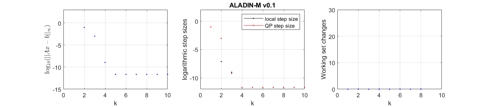

# Example for machine learning
Here we give a simple classification example how ALADIN-$\alpha$ can be used for machine learning problems.  The goal here is finding a suitable  parameter $w$ that classify the input data into its label.


## Loss Function
 Let $x_j$ be the j-th input data and $y_j$ be its label, let $N$ be the number of input data, let $n_x$ be the dimension of input data, let $w$ be the decision variable.   A $\ell_2$-regularized logistic regression is used as loss function that need to be optimized.

$$
\begin{aligned}
\min_{w\in \mathbb{R}^d}\; f(w) \triangleq \frac1N \sum_{j=1}^N log(1+e^{-y_j x_j^T w})+\frac{\gamma}{2} \lVert w \rVert_2^2
\end{aligned}
$$

The item $\frac{\gamma}{2} \lVert w \rVert_2^2$ is added in order to prevent overfitting and $\gamma$ is a hyperparameter chosen by user.

##Distributed Problem Setup

To solve this problem sufficiently,  we divide the input data set into several groups and each group means a subsystem. In this example, we set the number of subsystems $N_{subs}$ to 10, that is, the capacity of each subsystem is $cap=N/N_{subs}$.
```matlab
%% set basic parameters
import casadi.*;

data = importdata('ML_DATA.mat'); % import data set

point = data.input; % defeine data
class = data.class; % define label
% connect point and their label
set   = [point,class];


N     = size(point, 1); % number of input data
nx    = size(point, 2); % dimension of input data
Nsubs = 10; % number of subsystems
cap   = N/Nsubs;
gamma = 1; % choose hyperparameter gamma
```
Next, we define the decision variable $w$ and set up the OCP problem. Because the volume of each group is $cap$ and the dimension of data point is $n_x$, the dimension of $w$ should be $cap*n_x$. It is obvious that we can also divide $w$ into $cap$ groups, we denote it as $w_j, j =1,2,...,cap$. Therefore, equality constraints occurs naturally:
$$ 
\begin{aligned}
w_1 = w_2 = ... = w_{cap}
\end{aligned}
$$
Note that the form of the objective functions for each subsystem are same, so we define the objective function with parameter $xy$, which represents the input data and their labels for each subsystem. So we get:
```matlab
% define variables
w  = SX.sym('w', [cap*nx 1]); % decision variable
xy = SX.sym('xy', [cap*(nx+1) 1]); % data and label

% set up objective function and constraints
ff  = 0;
gg = [];
for i = 1:cap
    j   = (i-1)*nx;
    k   = (i-1)*(nx+1);
    ff  = ff + 1/N*log(1+exp(xy(k+nx+1)*xy(k+1:nx)'*w(j+1:nx))) +...
		    gamma/(2*N)*w(j+1:nx)'*w(j+1:nx); % objective function
    if i > 1
        for p = 1:nx
            gg = [gg; w(p)-w(j+p)]; % equality constraint
        end
    end
end
```
Next, we construct the consensus matrix $\{ A_i\}, i=1,2,...N_{subs}$.
```matlab
% create elements used to set matrix A
eyebase = eye(nx*cap);
zerobase = zeros(nx*cap);
% set up consensus constraints
AA{1} = repmat(eyebase, Nsubs-1, 1);
for i = 2:Nsubs
    AA{i} = [repmat(zerobase,i-2,1);eyebase;repmat(zerobase,Nsubs-i,1)];
end
```
In the last step, we convert the CasADi symbolic expressions to the MATLAB functions and set up the initial guess $z_i^0$ and $\lambda_0$. Note that the objective function is parameterized with input data $xy$ and the constraints for each subsystem are same.
```matlab
% convert expressions to MATLAB functions
for i = 1:Nsubs
    ML.locFuns.ffi{i} = Function(['f' num2str(i)], {w,xy}, {ff}); 
    ML.locFuns.ggi{i} = Function(['g' num2str(i)], {w,xy}, {gg});
    ML.locFuns.hhi{i} = Function(['h' num2str(i)], {w,xy}, {[]});
    
    % lower and upper boundary of variables will be set as default values
    ML.AA{i} = AA{i};
    ML.zz0{i} = zeros(nx*cap,1);
    ML.p{i}   = reshape(set((i-1)*cap + 1:cap, :)', [], 1);
end
```
## Distributed Problem with ALADIN-$\alpha$
To solve this distributed problem with ALDIN-$\alpha$, we still need to set up some options.
```matlab
% initialize the options for ALADIN
opts.rho = 1e3;
opts.mu = 1e4;
opts.maxiter = 10;
opts.term_eps = 0; % no termination criterion, stop after maximum iteration
opts.plot = 'true';

sol_ML = run_ALADIN(ML,opts);
```
If the option `plot` is `true`, we can see that the algorithm converges after about 5 iterations, which shows a very good convergence property.

 