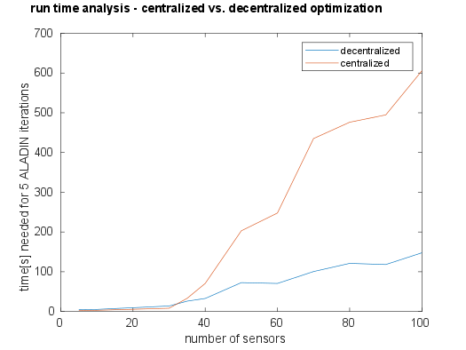

# Example for the usage of ALADIN with parfor option
Here we consider a sensor network localization problem from the [SIAM ALADIN paper](https://www.researchgate.net/publication/299465495_An_Augmented_Lagrangian_Based_Algorithm_for_Distributed_NonConvex_Optimization). 
We illustrate, how the `parfor` option of ALADIN-M can be used for parallel execution.
For this example the MATLAB parallel computing toolbox is reuired.

## Problem setup

Let $N$ be the number of agents and let $\chi_i =(x_i,y_i)^\top \in \mathbb{R}^2$ be the unknown position of the $i$th sensor, let $\eta_i$ be its estimated position, let $\xi_i$be the position of senosor $i+1$ estimated by sensor $i$ let $\bar{\eta_i}$ be the estimated distance between sensor $i$ and its neighbors. The measurement error is given by $\eta_i - \chi_i$ and is assumed to be Gaussian distributed with variance $\sigma_i^2 I_{2 \times 2}$. We further denote the measured distance between sensor $i$ and sensor $i + 1$ by $\bar{\eta_i}$. If we define the decision variable as $x_i = (\chi_i^\top, \xi_i^\top)^\top \in \mathbb{R}^4$ then we obtain the overall problem

$$
\begin{aligned}
\displaystyle \min_x &\sum_{i = 1}^N f_i(x_i)\quad  \\
\text{ s.t. } &\quad h_i(x_i) \leq 0 \quad \forall i \in \{1, \dots, N\}\\
& \quad\xi_i = \chi_{i+1}  \quad \text{ }\text{ }\forall i \in \{1, \dots, N\}
\end{aligned}
$$

with 
  
$f_i(x_i)=\frac{1}{4\sigma_i^2}\vert\vert\chi_i - \eta_i\vert\vert_2^2 + \frac{1}{4\sigma_{i+1}^2}\vert\vert\xi_i - \eta_{i+1}\vert\vert_2^2 + \frac{1}{2\sigma_{i+1}^2}(\vert\vert\chi_i - \xi_i\vert\vert_2^2  - \bar{\eta}_i)^2$

$h_i(x_i) = (\vert\vert\chi_i - \xi_i\vert\vert_2 - \bar{\eta_i})^2 - \bar{\sigma_i}^2$   


### Implementation

For the implementaiton, firstly the problem needs to be defined in a way that is compatible to the ALADIN solver. The definitions of variables and functions are executed in separate functions:

For the computation of $\eta_i$ and $\bar{\eta_i}$ the sensors are assumed to be equidistantly located in a circle, i.e.
$$
\chi_i = \left(N \cos (\frac{2i\pi}{N}), N \sin (\frac{2i\pi}{N})\right)
$$

 The measuremnt errors are assumed to be normal distributed with variance sigma. The neighbour of sensor $n$ is assumed to be sensor $1$, thus we define $\eta_{n+1} = \eta_1$. So we get:
```matlab
function [eta,eta_bar] = getEta(N, d, sigma)
% returns by sensor estimated initial position and distance to its neighbours
 
 eta     = zeros(d, N + 1);
 eta_bar = zeros(1, N);
 
 for i = 1 : N
     eta( :, i ) = [N * cos(2 * i * pi / N) + normrnd(0, sigma) ; ...
                    N * sin(2 * i * pi / N) + normrnd(0, sigma)];
     
     eta_bar(i)  = 2 * N * sin( pi / N) + normrnd(0, sigma);
 end
 
 eta(:, N + 1) = eta(:, 1);
end
```
Implementing $f$ and $h$ as above we obtain
```matlab
function [F] = getObjective(N, y, eta, eta_bar, sigma)

F = zeros(N, 1);
F = sym(F);

F(:) = 1 / (4 * sigma^2) * ((y(1, :) - eta(1, 1 : N)).^2 + (y(2, :) - eta(2, 1 : N)).^2) ...
 + 1 / (4 * sigma^2) * ((y(3, :) - eta(1, 2 : end)).^2 + (y(4, :) - eta(2, 2 : end)).^2) ...
 + 1 / (2 * sigma^2) * (sqrt((y(1, :) - y(3, :)).^2 + (y(2, :) - y(4, :)).^2) - eta_bar(:)').^2;

end
```

and
```matlab
function [H] = getInequalityConstr(N, y, eta_bar)

 H = zeros(N, 1);
 H = sym(H);
 
 H(:) = (sqrt((y(1, :) - y(3, :)).^2 + (y(2, :) - y(4, :)).^2) - eta_bar(:)').^2;

end

```

The coupling condition $\xi_i = \chi_{i+1}$ can be formulated as $\sum A_ix_i = 0$ with 

$$A_1 = \begin{pmatrix} 0 & I \\
 0 & 0 \\
 0 & 0 \\
 \vdots & \vdots \\
 0 & 0 \\
 -I & 0
 \end{pmatrix}, \quad
A_2 = \begin{pmatrix} -I & 0 \\
 0 & I \\
 0 & 0 \\
 \vdots & \vdots \\
 0 & 0 \\
 0 & 0
 \end{pmatrix}, \quad
A_3 = \begin{pmatrix} 0 & 0 \\
 -I & 0 \\
 0 & I \\
 \vdots & \vdots \\
 0 & 0 \\
 0 & 0
 \end{pmatrix}, \quad \cdots \quad,  \text{ } \quad
A_N = \begin{pmatrix} 0 & 0 \\
 0 & 0 \\
 0 & 0 \\
 \vdots & \vdots \\
 -I & 0 \\
 0 & I
 \end{pmatrix}
 $$

while setting 

$$I = \begin{pmatrix} 1 & 0 \\ 0 & 1 \end{pmatrix}$$

In Matlab this can be implemented as follows:

```matlab
function [AA] = getCouplingMatrix(N, n)
 I = [1, 0; 0, 1];
 A0 = zeros(2*N, n);

 A1 = A0;
 A1(1:2, 3:4) = I;
 A1(2*N - 1: 2*N, 1:2) = -I;

 AA(1) = mat2cell(A_1, 2 * N, n);

 for i = 2 : 1 : N
    A_i = A0;
    A_i(2*(i-2) + 1 : 2*(i-2) + 2, 1:2) = -I;
    A_i(2*i - 1: 2*i, 3:4 ) = I;
    AA(i) = mat2cell(A_i, 2*N, n);
 end
end
```

A start vector can be defined similarly to the estimated positions:

```matlab
function [zz0] = getStartValue(N, sigma)
 initial_position = zeros(2, N);

 for i = 1  : N
    initial_position(1, i) = N * cos( 2 * i * pi / N ) + normrnd(0, sigma);
    initial_position(2, i) = N * sin( 2 * i * pi / N ) + normrnd(0, sigma);
 end

 zz0 = cell(1, N);
 for i = 1 : N-1
    zz0(i) = {[initial_position(:, i); initial_position(:, i + 1)]};
 end
 zz0(N) = {[initial_position(:, N); initial_position(:, 1)]};

end
```

such that the overall problem can be set up  with the following function:


```matlab
function [sProb ] = setupSolver(N, sigma)

% general setup

n       = 4;   % dimension of design variables          
d       = 2;   % dimension of coordinate system 

% initialization of variables
 y = sym('y%d%d', [N n], 'real');
 y = y';


 [eta, eta_bar] = getEta(N, d, sigma);          % definition of estimated initial positions
 F   = getObjective(N, y, eta, eta_bar, sigma); % definition of objective functions
 H   = getInequalityConstr(N, y, eta_bar);      % definition of inequality constraint
 AA  = getCouplingMatrix(N, n);                 % definition of coupling matrix
 zz0 = getStartValue(N, sigma);                 % definition of start value for optimization


%% setting up solver

% set search area
sProb.llbx = cell(1, N);
sProb.uubx = cell(1, N);
for i = 1 : N
    sProb.llbx(i) = mat2cell([-inf; -inf; -inf; -inf], 4, 1);
    sProb.uubx(i) = mat2cell([ inf;  inf;  inf;  inf], 4, 1);
end

% handover of functions
sProb.locFuns.ffi          = cell(1, N);
sProb.locFuns.hhi          = cell(1, N);


for i = 1 : N
    sProb.locFuns.ffi(i) = {matlabFunction(F(i), 'Vars', {y(:, i)})} ;
    sProb.locFuns.hhi(i) = {matlabFunction(H(i), 'Vars', {y(:, i)})} ;
end


sProb.AA = AA;
sProb.zz0 = zz0;


```
### Runtime Analysis
For the runtime analysis, the idea is to ŕun the sensor network localization problem with varying number of sensors both with a decentral and a central optimization step. To do so, firstly a vector with a number of sensors is needed  and secondly a vector with variances. Then, the time needed for the decentral and the central optimization is measured and can be plotted. 
```matlab
N = [5, 10, 15 , 20, 25, 30, 35, 40, 50, 60, 70, 80, 90, 100];
sigma = [0.5, 1, 1.5, 2, 2.5, 2.5, 2.5, 2.5, 2.5, 2.5, 2.5, 2.5, 2.5, 2.5];

time = zeros(2, length(N));
for i = 1 : length(N)
    sProb = setupSolver(N(i), sigma(i));
    opts.parfor = 'true' 

    time_parfor = tic;
    sol = run_ALADINnew(sProb, opts);
    time(1, i) = toc(time_parfor);

    time_for = tic;
    sol = run_ALADINnew(sProb, opts);
    time(2, i) = toc(time_for);
end

figure 
plot(N, time(1, :))
title('runtime analysis')
hold on

plot(N, time(2, :))
hold off
legend('decentral optimization', 'central optimization')

```
### Result
The runtime result can be obtained from the following figure. 

 

Thus, for the case of the senor network localization problem a significant runtime improvement can be observed when the parfor option is set. Nonetheless it needs to be mentioned that an improvement on the runtime cannot always be achieved for every problem setup using the parfor option. In general, parfor is useful when the number of local optimization problems is large and the time for solving each of the local  optimization problems is relatively long. For details, see [decide when to use parfor](https://de.mathworks.com/help/parallel-computing/decide-when-to-use-parfor.html;jsessionid=4c67399db5b15c1b7951a965e1c7)