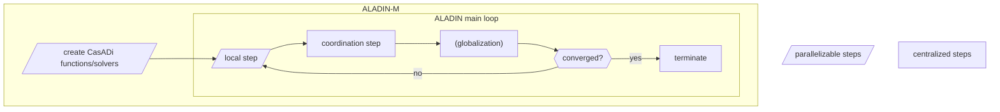

# Code structure

 

## As markdown code

```mermaid
graph TD    
    subgraph ALADIN-M
    E[/create CasADi functions/solvers/] -->F
    subgraph ALADIN main loop
    F[/local step/] --> G[coordination step] --> I["(globalization)"]-->H{{converged?}}-->| no| F
    H -->|yes| L[terminate]
    end
    end
    K[/parallelizable steps/] 
    J[centralized steps]  
```
