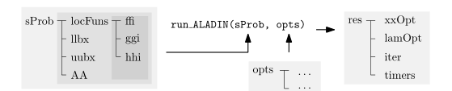
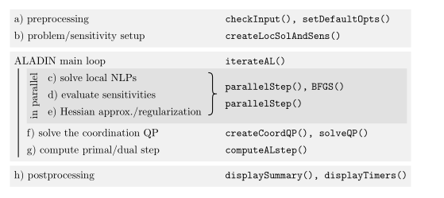

# Code structure

<!--[Flow chart](flowChart.svg)--->

## Solver input and output 

A summary of the solver in- and outputs can be extracted from the following figure.

ALADIN-$\alpha$ can be started by running the function $\texttt{run\_ALADIN}$. As input, two structs $\texttt{sProb}$ and $\texttt{opts}$ are needed. The struct $\texttt{sProb}$ defines the problem definition. The struct $\texttt{opts}$ hands over the set solver options. The latter ones are described in detail [here](options.md). $\texttt{sProb}$ contains five fields namely the coupling matrix $\texttt{AA}$, the upper bound of the design area $\texttt{uubx}$, the lower bound of the design area $\texttt{llbx}$, the start value $\texttt{zz0}$ which are itself $1  \times \texttt{N}$ cells ($\texttt{N}$ is the number of subsystems) and the objective and constraint functions, which are stored in $1\times \texttt{N}$ cells and collected in the struct $\texttt{locFuns}$, which itself is a struct with one field.

The function $\texttt{run\_ALADIN}$ returns a result struct $\texttt{res}$ containing a cell $\texttt{xxOpt}$ with the optimal solution, a cell $\texttt{lamOpt}$ with the optimal Lagrange multipliers $\lambda$, a struct $\texttt{iter}$ that loggs iteration results and a struct $\texttt{timers}$ that loggs the times needed for the different iterations.

## Solver structure 
The code is structured into different parts and can be extracted from the following figure.

First of all, a preprocessing step is conducted. With the function $\texttt{checkInput}$, the given $\texttt{sProb}$ and $\texttt{opts}$ are checked on plausibility. The function $\texttt{setDefaultOpts}$ completes the options $\texttt{opts}$ that were handed over. Afterwards, the problem and sensitivities are setup with the help of the function $\texttt{createLocSolAndSens}$. This includes to first convert the functions given in $\texttt{locFuns}$ to  CasADI functions and to setup the solver using the given options. Afterwards, the main loop $\texttt{iterateAL}$ of the algorithm starts. The loop consists of five steps. In the $\texttt{parallelStep}$, three of them are conducted in parallel, namely solving the decoupled non linear problems, evaluating the new sensitivities and approximating the new Hessians. Step four and five during the interation loop are to solve the coordination QP and to compute the primal/dual step. After a termination criterion is fulfilled, postprocessing starts including displaying the needed number of iterations and displaying timers.
