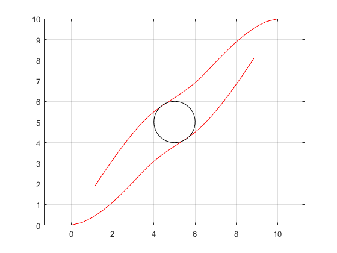

# Distributed MPC for Mobile Robots
Here we give an example how ALADIN-M can be used for distributed Model Predictive Control. In particular, we show how the distributed parametric programming option and the the problem reuse option of ALADIN-M are useful. The example is similar to the example from [1]. The goal here is that two modile robots exchange their positions while keeping a certain distance. This task can be formulated as a contiuous-time optimal control problem (OCP)

$$
\begin{aligned} 
&\min_{x_i(),u_i(), \forall i \in \mathcal{R}} \int_0^T \sum_{i\in \mathcal{R}} \|x_i-x^e_i\|_{Q_i}^2 + \|u_i\|_{R_i}^2\, dt  \\
\quad \text{s.t.} \quad  & \dot x_i(t) = f_i(x_i(t),u_i(t)),  x_i(0)=z_{i0}, && \forall i \in \mathcal{R} \\ 
&(z,y)_i^\top(T)=(z^e,y^e)_i^\top, &&\forall i \in \mathcal{R} \\
& \|(z, y)_i^\top(t)-(z, y)_j^\top(t)\|_2^2\geq d^2, && i \neq j.
\end{aligned}
$$

Here, $z_i=(x_i\; y_i\; \theta_i)^\top$ is the state of each robot $i \in \mathcal{R}$, $x_i$ and $y_i$ describe the robots position in the $x$-$y$-plane, and $\theta_i$ is the yaw angle with respect to the $x$-axis (cf. figure below). Note that the initial condition can here be interpreted as the parameter $p_i$ in the [format siutable for ALADIN-M](index.md). The robots' dynamics is given by 
$$
\dot x_i= f_i(x_i,u_i) :=
\begin{pmatrix}
v_i\cos (\theta_i)  & v_i\sin(\theta_i) & \omega_i 
\end{pmatrix}^\top , \;
%\begin{pmatrix}
%\cos (\theta_i) & 0 \\
%\sin(\theta_i) & 0 \\
%0 & 1
%\end{pmatrix}
%\begin{pmatrix}
%v_i \\ \omega_i
%\end{pmatrix}, \quad 
 i \in \{1,2\}.
$$


## Distributed Problem Setup
Code-wise, we set up the right-hand-side of the ode dynamics from above as
```matlab
% define robot models
ode = @(x,u) [ u(1)*cos(x(3));
               u(1)*sin(x(3));
               u(2)];   
```
Next, we prepare ourself for setting ob the robots' OCPs. We construct our problem using CasADi. Specifically, we create cells `XX` amd `UU` containing the CasADi symbolic variables for the states $z$ and the inputs $u$ over the horizon-length $T$. Moreover, we introduce a cell with state copies `ZZZ` containing the state information of neighboring robots in order to allow each robot to fulfill the distance inequality constraint ${\|(z, y)_i^\top(t)-(z, y)_j^\top(t)\|_2^2}\geq d^2$. Note that we will enforce the copied and the original state to coincide later by the consensus constraint $\sum_{i\in \mathcal{R}} A_ix_i=b$ in the [ALADIN-M format](index.md).
```matlab
%% set up OCP
import casadi.*
Nrobot = 2;

T   = 1;        % Time horizon
dT  = 0.1;      % sampling time
d   = 2;        % minimal distance between robots

N   = T/dT;
Nmpc = 40;

for i=1:Nrobot
    % inputs/states
    XX{i}  = SX.sym(['x' num2str(i)], [3 N]);
    % state copies
    for k=setdiff(1:Nrobot,i)
       ZZZ{i}{k} =  SX.sym(['z' num2str(i) num2str(k)], [3 N]);
    end
    UU{i}  = SX.sym(['u' num2str(i)], [2 N]);
    XX0{i} = SX.sym(['xx0' num2str(i)], [3 1]);
end
```
Now we are ready to set-up a discretized version of the above OCP. Note that we contruct this OCP in a loop setting up the OCPs for all robots individually. Here we use a [Heun-discretization](https://en.wikipedia.org/wiki/Heun%27s_method) scheme. 

```matlab
% starting points/destinations
%            from  to       
ppNum{1} = [ 0     10; 
             0     10
             0     0  ];
ppNum{2} = [ 10    0; 
             10    0;
             0     0  ];

% for each robot ...           
for i=1:Nrobot
    JJ{i}   = 0;
    gg{i}   = [];
    hh{i}   = [];
    llbu{i} = [];
    uubu{i} = [];

    % over horizon ...
    for j=1:N - 1
        % ode/stage cost with Heun discretization
        gg{i}      = [ gg{i}; XX{i}(:,j+1) - XX{i}(:,j) - dT*0.5*(ode(XX{i}(:,j),UU{i}(:,j))+ ode(XX{i}(:,j+1),UU{i}(:,j+1)))];
        JJ{i}      = JJ{i} + (XX{i}(:,j)-ppNum{i}(:,2))'*diag([1 1 0])*(XX{i}(:,j)-ppNum{i}(:,2)) ...
                           +  UU{i}(:,j)'*UU{i}(:,j);
        % distance constraint
        hh{i}  = [hh{i}; -(XX{i}(1:2,j)-ZZZ{i}{3-i}(1:2,j))'*(XX{i}(1:2,j)-ZZZ{i}{3-i}(1:2,j)) + d^2];
    end
    % initial condition
    gg{i} = [gg{i}; XX{i}(:,1) - XX0{i}];
end
        
for i=1:Nrobot
   ZZZ{i}{i} = XX{i};
   ZZZi      = vertcat(vertcat(ZZZ{i}{:}));
   UUi       = UU{i};
   XXU{i}    = [ ZZZi(:); UUi(:)];
end
```

Next, we construct the consensus matrices $\{A_i\}_{i \in \mathcal{R}}$. As mentioned before, we construct them such that the original trajectories coincide with the copied trajectories. 

```matlab
% set up consensus constraints
Abase   = [ eye(Nrobot*N*3) zeros(Nrobot*N*3,2*N)];
zerBase = zeros(size(Abase));
for i=1:Nrobot-1
   AA{i}   =  [repmat(zerBase,i-1,1); Abase; repmat(zerBase,Nrobot-i-1,1)];
end
AA{Nrobot} = - repmat(Abase,Nrobot-1,1);
```

In a last step, we convert the CasADi symbolic expressions to evaluatable and set up the initial guesses $z_i^0$ and $\lambda^0$. Note that the local equality constraints collected in `rob.locFuns.gg` are parametrized with the initial condition `X0` for the ode of the robots here. With that, we will be able to efficiently reuse the problem formulation in an MPC  loop as we shall see next.

```matlab
% convert expressions to MATLAB functions
X0       = vertcat(XX0{:});
ppNumAll = [ppNum{1}(:,1); ppNum{2}(:,1)];

for i=1:Nrobot
    rob.locFuns.ffi{i} = Function(['f' num2str(i)],{XXU{i}},{JJ{i}});
    rob.locFuns.ggi{i} = Function(['g' num2str(i)],{[XXU{i};X0]},{gg{i}});
    rob.locFuns.hhi{i} = Function(['h' num2str(i)],{XXU{i}},{hh{i}});
    
    % set up ALADIN parameters
    rob.llbx{i}  = -inf*ones(length(XXU{i}),1);
    rob.uubx{i}  =  inf*ones(length(XXU{i}),1);
    rob.AA{i}    = AA{i};
    
    rob.zz0{i}   = [vec(DM(repmat(ppNumAll,1,N))); zeros(2*N,1)];
end
```

## Distributed MPC with ALADIN-M
After setting up some options, the discretized OCP can be solved with ALADIN-M. Here we do that within an Model Predictive Control loop, where we use the `reuse` option of ALADIN-M in order to to construct the derivatives and local solvers only once. Note that the initial position of the robots changes in each iteration, cf. [2] for more information on MPC.

```matlab
rob.lam0   = 0*ones(size(AA{1},1),1);
rob.p      = ppNumAll;
opts.plot  = 'false';
opts.reuse = 'true';
opts.maxiter  = 50;
opts.term_eps = 1e-8;

Xopt  = ppNumAll;
for i = 1:Nmpc
    sol_rob{i} = run_ALADINnew(rob,opts);
    Xopti = [];
    for j = 1:Nrobot
        Xopti = [Xopti; full(sol_rob{i}.xxOpt{j}(3*(Nrobot+j-1)+(1:3)))];
    end
    Xopt = [Xopt, Xopti];
    rob.zz0 = sol_rob{i}.xxOpt;
    rob.p = Xopt(:,i+1);
    rob.reuse = sol_rob{1}.reuse;
end
```

To see the advantage of distributed parametric programming in combination with the `reuse` option, we can have a look at the computation times. In the first iteration, ALADIN-M needs `.8` seconds for the problem setup and `.7` seconds for iterating. After the second iteration however, the time for problem setup will be `0` and also the iteration time is halfed on my computer to `.3` seconds due to the fact that also the previous solution is used as an initial guess for ALADIN-M. This shows how the `reuse` option of ALADIN-M can be used to make distributed MPC more efficient. 

The resulting closed-loop trajectories are shown in the following figure. Not that the distance constraint ${\|(z, y)_i^\top(t)-(z, y)_j^\top(t)\|_2^2}\geq d^2$ is satisfied while the robots exchange tehir position. 



## Decentralized MPC
Not that for decentralized MPC, the bi-level variants with decentralized ADMM and decentralized conjugate gradients can be used which can be activated via the option `innerAlg`.


[1] [Engelmann, A., Jiang, Y., Houska, B., & Faulwasser, T. (2019). Decomposition of non-convex optimization via bi-level distributed ALADIN. arXiv preprint arXiv:1903.11280.](https://arxiv.org/abs/1903.11280) 

[2] [Rawlings, J. B., & Mayne, D. Q., Diehl, M. (2017). Model Predictive Control: Theory, Computation and Design. Nob Hill Pub.](https://sites.engineering.ucsb.edu/~jbraw/mpc/)
