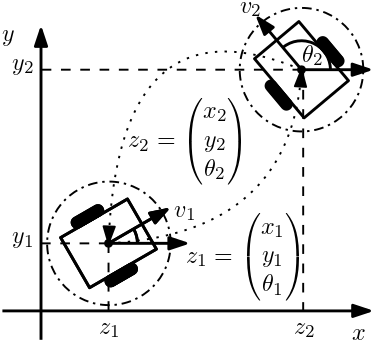

# Distributed MPC for Mobile Robots
Here we give an example how ALADIN-M can be used for distributed Model Predictive Control. In particular, we show how the distributed parametric programming option and the the problem reuse option of ALADIN-M are useful. The example is similar to the example from [1]. The goal here is that two modile robots exchange their positions while keeping a certain distance. This task can be formulated as a contiuous-time optimal control problem (OCP)
$$
\begin{aligned} 
&\hspace{-2em}\min_{z_i(\cdot),u_i(\cdot), \forall i \in \mathcal{R}} \int_0^T \sum_{i\in \mathcal{R}} \|z_i-z^e_i\|_{Q_i}^2 + \|u_i\|_{R_i}^2\, dt  \\
\quad \text{s.t.} \;\;\; & \dot z_i(t) = f_i(z_i(t),u_i(t)),\;\;  z_i(0)=z_{i0}, && \forall i \in \mathcal{R} \\ 
&(x,y)_i^\top(T)=(x^e,y^e)_i^\top, &&\forall i \in \mathcal{R} \\
& \|(x, y)_i^\top(t)-(x, y)_j^\top(t)\|_2^2\geq d^2, && i \neq j.
\end{aligned}
$$
Here, $z_i=(x_i\; y_i\; \theta_i)^\top$ is the state of each robot $i \in \mathcal{R}$, $x_i$ and $y_i$ describe the robots position in the $x$-$y$-plane, and $\theta_i$ is the yaw angle with respect to the $x$-axis (cf. figure below). Note that the initial condition can here be interpreted as the parameter $p_i$ in the [  format siutable for ALADIN-M](index.md). The robots' dynamics is given by 
$$
\dot z_i= f_i(z_i,u_i) :=
\begin{pmatrix}
v_i\cos (\theta_i)  & v_i\sin(\theta_i) & \omega_i \end{pmatrix}^\top \hspace{-2mm}, \;
%\begin{pmatrix}
%\cos (\theta_i) & 0 \\
%\sin(\theta_i) & 0 \\
%0 & 1
%\end{pmatrix}
%\begin{pmatrix}
%v_i \\ \omega_i
%\end{pmatrix}, \quad 
 i \in \{1,2\}.
$$

 

## Distributed MPC with ALADIN

## Distributed MPC with ADMM

## Decentralized MPC?

[1] [Engelmann, A., Jiang, Y., Houska, B., & Faulwasser, T. (2019). Decomposition of non-convex optimization via bi-level distributed ALADIN. arXiv preprint arXiv:1903.11280.](https://arxiv.org/abs/1903.11280) 