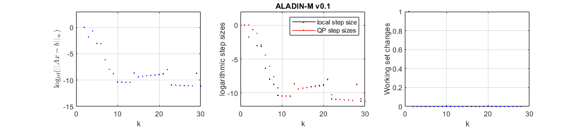

# ALADIN-M

ALADIN-M is a toolbox for distributed non-convex optimization in MALTAB with  [ALADIN](https://epubs.siam.org/doi/abs/10.1137/140975991) and ADMM.
A detailed documentation can be found [here](https://alexe15.github.io/ALADIN.m/).


## Getting started
1. Download ALADIN-M and add the `\src` folder to you MATLAB path.
2. Run `\exampels\main_example.m`.


## Highlights
ALADIN-M 
- supports general partially separable NLPs;
- provides a unified interface for ALADIN and ADMM and a centralized solver for direct comparison;
- supports parallel computing;
- comes with a rich set of examples from power systems, estimation and control;
- (runs with Octave?)

## Requirements:
ALADIN requires
- [CasADi](https://web.casadi.org/) optimization and automatic differentiation;
- the MATLAB [parallel computing toolbox](https://de.mathworks.com/products/parallel-computing.html) for parallel computin (if needed);
- the MATLAB [symbolic math toolbox](https://de.mathworks.com/products/symbolic.html) (only for some examples).

## Example
Suppose we would like to solve the problem 

$$
\begin{aligned}  
&	\min_{y_1,y_2 \in \mathbb{R}^2}   2 \,(y_{11} - 1)^2 +   (y_{22} - 2)^2\\
\;\;\text{subject to} \;\;    &  1 - y_{11}\,y_{12} \leq 0, \quad 
    -1.5 + y_{21} y_{22} \leq 0, \\
    &(\,0 \;\; 1\, )\,y_1 \;\;+\; \;(\,-1 \;\; 0 \,)\,y_2 = 0,
\end{aligned}
$$
which is in form of....
This non-convex problem can be solved by ALADIN-M with the following code snippet.

```
% define local objective functions
f1 = @(x) 2 * ( x(1) - 1)^2;
f2 = @(y) (y(2) - 2)^2;

% local nonlinear inequality constraints
h1 = @(x) (1 - x(1) * x(2));
h2 = @(y) (-1.5 + y(1) * y(2));

% coupling matrices
A1  =   [ 1,  0;
          0,  1];
A2  =   [-1   0;
          0, -1];
     
% collect variables in sProb struct
sProb.locFuns.ffi  = {f1, f2};
sProb.locFuns.hhi  = {h1, h2};
sProb.AA           = {A1, A2};

% solve with ALADIN-M
sol_ALADIN = run_ALADINnew( sProb ); 
````
This yields the output
```
   ================== ALADIN response ===================    
                                                                
   ============== ALADIN iteration summary ==============    
                                                                
Current iteration: 30
                                                                
Applied solvers: 
QP solver:        MA57
Local solver:     ipopt
Inner algorithm:  none
                                                                
No specific termination error bound was handed over.
Remaining iterations:         0
Current constraint violation: 6.6531e-12
                                                                
Maximum number of iterations is reached.
                                                          
   ==================   ALADIN timing   ==================
                  t[s]              %tot              %iter             
Tot time......:     3.4                                                 
Prob setup....:     0.14             4.2                                
Iter time.....:     3.25            95.6                                
 ---------                                                              
NLP time......:     0.93                              28.8              
QP time.......:     0.08                               2.4              
Reg time......:     0.02                               0.6              
Plot time.....:     1.99                              61.4     
```
and a primal-optimal solution
```
>> sol_ALADIN.xxOpt{:}

ans =

    0.8166
    1.8369


ans =

    0.8166
    1.8369
```

By default ALADIN-M shows progress in the iterations e.g. by the consensus gap $\text{log}_{10}(\|Ax-b\|_\infty)$ and the stepsizes in the local step and the coordination. 



Note that the above is a reformulation of the problem

$$
\begin{aligned} 
\min_{x_1,x_2\in \mathbb{R}} & \;f(x)=2 \, (x_1 - 1)^2 + (x_2 - 2)^2 \\
\text{subject to}&\quad -1 \leq x_1 \, x_2 \leq 1.5 
\end{aligned}
$$
by introducing auxiliary variables and additional consensus constraints.


## License
ALADIN-M comes under the [MIT license](https://en.wikipedia.org/wiki/MIT_License), see the [license file](https://github.com/alexe15/ALADIN.m/blob/master/LICENSE.txt).